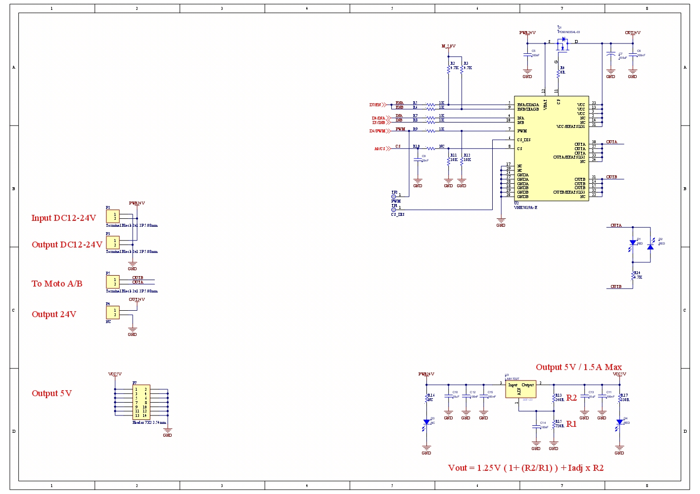
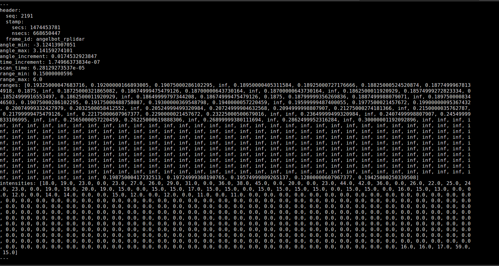
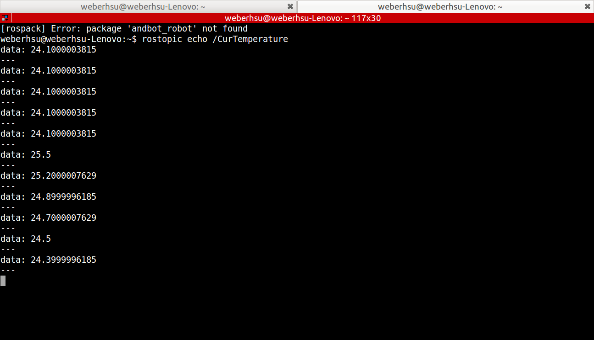
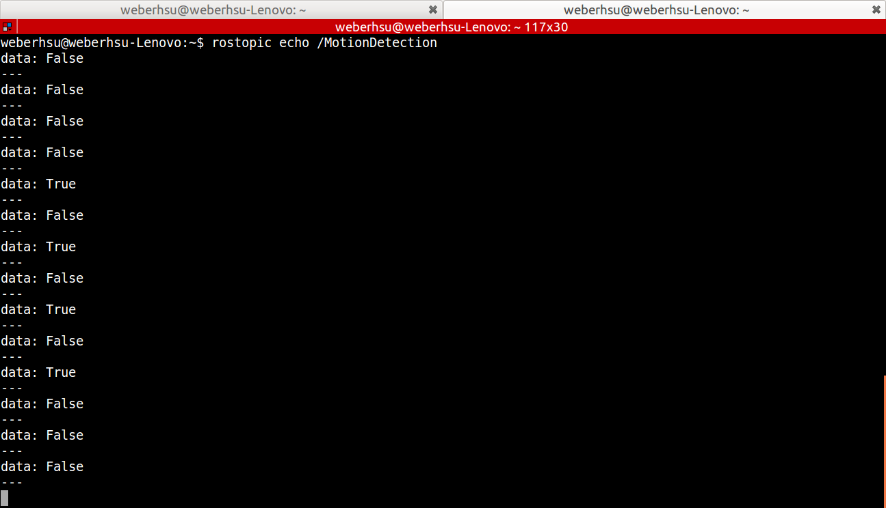
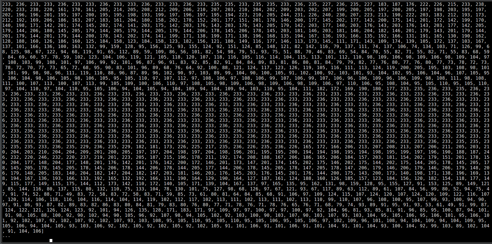

<h1 align="center">
   
  Instructions for fundamental testing on angel 
</h1>

<p align="center">
<b><a href="#overview">Overview</a></b>
|
<b><a href="#table-of-contents">Table of contents</a></b>
|
<b><a href="#preparing-for-testing">Preparing for testing</a></b>
|
<b><a href="#system-architecture">System architecture</a></b>
|
<b><a href="#module-test">Module test</a></b>
|
<b><a href="#function-test">Function test</a></b>
|
<b><a href="#team">Team</a></b>
|
<b><a href="#license">License</a></b>
</p>

## Overview

This is a guiding repository that gives you basic instructions to test and drive our robot system, **angel** for this case. 
Required firmwares and programs are all included in this repository. 
**Please go through this document very carefully.**
In addition, this repository is also designated to store angel's design files, including system block diagram, schematic of electronic components and CAD files, etc. 
They are placed in the **/hardware_design** folder. 
 

## Table of contents
* [**Preparing for testing**](#preparing-for-testing)
* [**System architecture**](#system-architecture)
* [**Module test**] (#module-test) 
  * [**Base driving test**](#base-driving-test)
  	* [**Step 1 Check hardware setups for base driving control**](#step1-check-hardware-setups-for-base-driving-control)
  	* [**Step 2 Upload firmware to vnh5019**](#step-2-upload-firmware-to-vnh5019)
  	* [**Step 3 Upload firmware to mega2560**](#step-3-upload-firmware-to-mega2560)
  	* [**Step 4 Drive angel base**](#step-4-drive-angel-base)
  * [**Laser scan test**](#laser-scan-test)
  	* [**Step 1 Check hardware setup to receive data from laser scanner**](#step-1-check-hardware-setup-to-receive-data-from-laser-scanner)
  	* [**Step 2 Launch rplidar**](#step-2-launch-rplidar)
  * [**Camera Joint control test. To be continue ...**](#camera-joint-control-test)
  	* [**Step 1 Check hardware setup to control camera position**](#step-1-check-hardware-setup-to-control-camera-position)
  	* [**Step 2 Uploading firmware to camera joint driver vnh5019**](#step-2-upload-firmware-to-camera-joint-driver-vnh5019)
  	* [**Step 3 Control camera joint**](#step-3-control-camera-joint)
  * [**Security Sening test. To be continue ...**](#security-sensing-test)
  	* [**Step 1 Check the sensor setup**](#check-the-sensor-setup)
  	* [**Step 2 Read each sensor**](#read-each-sensor)
  * [**Camera image topic test**](#camera-image-topic-test)
  	* [**Step 1 Check camera setup**](#step-1-check-camera-setup)
  	* [**Step 2 Run camera on odroid**](#step-2-run-camera-on-odroid)	  
* [**Function test**](#function-test)
  * [**Tele-operation**](#tele-operation)
  * [**Auto docking To be continue ...**](#auto-docking) 
* [**Appendix**](#appendix)

## Preparing for testing

1. Prepare your odroid XU4 board with ubuntu 14.04 on it.
2. Find a monitor and a hdmi cable and connect to odroid.
3. Check odroid IP address. 
	
	Power on odroid and open a terminal and type the following command on odroid board.
	
	```
	ifconfig
	``` 
	On angel-1.1, IP address should be `192.168.25.110` 
4. Download this repository and compile it on odroid by going though the following steps.

	On a terimal, please type the following command.
	
	```
	ssh odroid@[Odroid IP address]
	cd ~/catkin_ws/src
	git clone https://github.com/advancedroboticsaws/angel.git
	cd ~/catkin_ws
	catkin_make 
	```  

## System architecture

This section gives you an overview on angel's design.

**Note: All files related to angel's hardware design are placed in the folder `/hardware_design`.** 

* Overall block diagram


* Specifications -- not available yet

* Detailed wiring schematics -- not available yet 

* Schematic of DC motor driver board `vnh5019`



  
## Module test

Here, we separate Angel into several modules. 

<p align="center">
<b><a href="#base-driving-test">Base driving test</a></b>
|
<b><a href="#laser-scan-test">Laser scan test</a></b>
|
<b><a href="#camera-joint-test">Camera joint test</a></b>
|
<b><a href="#security-sensing-test">Securit Sensing test</a></b>
|
<b><a href="#camera-image-topic-test">Camera image topic test</a></b>
</p>

### Base driving test

<a name="base-driving-test-step1"></a>

#### Step 1 `Check hardware setups for base driving control`

Check all the hardware setup !!

Here we regard motor-control module as a motor **JGB37 3530B** + base driver **vnh5019**.
Also, both motor-control module for each wheel must be connected to mega2560.

Mark the following checklist yourself when you finish each setup.

- [ ] Check your motor model. Make sure you have installed the right one.
- [ ] Motor control modules are well connected. Each of them has correct wiring to their base driver.
- [ ] Left wheel motor control module connects to mega2560 correctly.  
- [ ] Right wheel motor control module connects to mega2560 correctly. 

**Note: If you are have any doubt, not sure what you remember when you set up all the hardwares and wirings, please review system diagrams and double check before going to next step.**

After you finish first step, you are about to make wheels spin.
There are two control boards that should have firmwares uploaded, **mega2560 & vnh5019**. 
Firmware uploading steps for both of them are slightly different. 
Instructions for each are separated as follows.

<a name="base-driving-test-step2"></a>

#### Step 2 `Upload firmware to vnh5019` 

Firmware for each wheel's driver is inside the folder.

```
/mcu_control/base_control/vnh5019_base/src
```

* Upload firmware to left/right wheel
	1. Open `vnh5019_base.ino` with Arduino IDE on your PC.
	2. Please go to line 8 and 9. Uncomment one of these two lines according to which wheel you are about to do the uploading. 
	3. Modify Arduino PWM Frequency in Arduino IDE. 
		
		Copy
		
		```
		/mcu_control/wiring.c
		```
		 to ~/arduino-1.6.5/hardware/arduino/avr/cores/arduino.
		 
		 Make sure the following code is on line 31 or 32 in wiring.c.   
		 
		 ```
		 #define MICROSECONDS_PER_TIMER0_OVERFLOW (clockCyclesToMicroseconds(8 * 256))
		 ```
	4. Set your upload target to **promini**.
	5. Choose your **port** carefully.
	6. Go for it! Click upload!
		
		If you get any error when uploading,
		* Please look into the errors carefully.
		* Please check the port you choose.
		* Please make sure you have put all the libraries into the folder.
			If you get the message about library conflict, please find out those files and delete the old one.
			   
	7. Go though the steps above again **for the other wheel**.
	

<a name="base-driving-test-step3"></a>

#### Step 3 `Upload firmware to mega2560` 

Firmware for mega2560 is inside the following folder.

```
/mcu_control/base_control/mega_base_ultrasonic_angelbot/src
```

* Upload firmware to mega2560
	1. Open `mega_base_ultrasonic_angelbot.ino` with Arduino IDE on your PC.
	2. Libraries for this firmware is placed in	
	
		```
		/mcu_control/mega_base_ultrasonic_angelbot/lib
		``` 
	   Copy all contents inside and paste them to `/%document%/arduino/libraries` folder on your PC.
	3. Make sure the following code is on line 31 or 32 in wiring.c.   
		 
		 ```
		 #define MICROSECONDS_PER_TIMER0_OVERFLOW (clockCyclesToMicroseconds(8 * 256))
		 ```
		 If you don't understand this step, please refer to step 2 Upload firmware to vnh5019 above to find out. 
	4. Set your upload target to **mega2560**.
	5. Choose your **port** carefully.
	6. Go for it! Click upload!
		If you get any error when PC uploading,
		* Please look into the errors carefully.
		* Please check the port you choose.
		* Please make sure you have put all the libraries into the folder.
			If you get the message about library conflicts, please find out those files and delete the old one.   
	
<a name="base-driving-test-step4"></a>

#### Step 4 `Drive angel base`

1. Open a terminal on you PC and type

	```
	ssh odroid@192.168.25.110
	```
	to access to angel.
2. Start the roscore up.
	Type the following command.
		
	``` 
	roscore
	```
3. The next step should be starting communication between odroid and mega2560 through ROS.
	Open another termimal and use ssh command to access into odroid then type:
	
	```
	rosrun rosserial_python serial_node.py _port:=/dev/mega_base _baud:=115200
	```
4. Open another terminal and access into odroid by entering ssh commands (step1) then type:
	
	```
	rostopic list
	```   
	Check the topic list to make sure communication between mega2560 and your odroid is set.
5. Send a command to drive each wheel. Type the following command
	
	```
	rostopic pub /cmd_wheel_angularVel angelbot/WheelCmd "speed1: 1.0 speed2: 1.0 driverstate: false" 
	```
	If you have no error, you may see something like this on the terimal
	
	```
	odroid@odroid:~$ rostopic pub /cmd_wheel_angularVel angelbot/WheelCmd "speed1: 1.0 speed2: 1.0 driverstate: false"
	publishing and latching message. Press ctrl-C to terminate 
	```   
6. Make sure both wheel are spinning in the correct direction with a reasonable speed.
7. If you finish all the steps, send a 0 speed command and terminate command mode by typing ctrl-c.
	
<p align="right">
<b>End of base driving test</b>
|
<a href="#">BACK TO TOP</a>
</p>

### Laser scan test

The laser scanner we use is **rplidar**. 
To be able to use it, the complete hardware setup should contain rplidar + transmission board.

<a name="laser-scan-test-step1"></a>

#### Step 1 `Check hardware setup to receive data from laser scanner`

Mark the following checklist yourself when you finish each setup.

- [ ] Check your data transmission board. Make sure you installed the right one.

**Note: If you have any doubt, not sure what you remember when you set up all the hardwares and wirings,
please review system diagrams or datasheet and double check before going to next step.**

<a name="laser-scan-test-step2"></a> 

#### Step 2 `Launch rplidar`

This test is to help you find out whether the rplidar you installed is functional and your hardware setup is correct.
Before going through the steps below, please mark the following checklist yourself when you finish each setup.

* Launch laser scanner
	1. Open a terminal on you PC and type
	
		```
		ssh odroid@192.168.25.110
		```
		to access to angel.
	2. The next step should be starting communication between odroid and rplidar through ROS.
		Open another termimal and type:
		
		```
		roslaunch angelbot rplidar.lanuch 
		```
		
		You will see something like this
		
		```
		started roslaunch server http://192.168.25.110:60968/

		SUMMARY
		========
		
		......
		......
		
		NODES
		  /
		    rplidarNode (rplidar_ros/rplidarNode)
		
		......
		......
		RPLidar health status : 0
		```
	3. Open another terminal and type:
		
		```
		rostopic list
		```   
		Check if there is a topic name **/scan**. 
	4. Type the following command to see if there is anything shows up.
		
		```
		rostopic echo /scan
		```   
		You will see something similar on your terminal:
		
		

<p align="right">
<b>End of laser scan test</b>
|
<a href="#">BACK TO TOP</a>
</p>

### Camera Joint control test

<a name="camera-joint-control-step1"></a>

#### Step 1 `Check hardware setup to control camera position`

The recent version of Angel's camera joint consists of a motor-control module same as the one used to control wheels.
(a motor **JGB37 3530B** + base driver **vnh5019**).
This motor-control module must also be connected to mega2560.

**Cautions!!**

**We do not have `limit switch` on the joint, which is supposed to prevent Angel's joint or housing damages from operators giving position commands that the joint cannot reach.   
So please check the following list carefully.**

Mark the following checklist yourself when you finish each setup.

- [ ] Check your motor model. Make sure you have installed the right one.
- [ ] Motor control module is well connected. It has correct wiring to its driver.
- [ ] Motor control module connects to mega2560 correctly.
- [ ] **Please make sure Angel's camera is headed in Z direction, that is, toward the sky.** 

**Note: If you are have any doubt, not sure what you remember when you set up all the hardwares and wirings, 
please review system diagrams and double check before going to next step.**

<a name="camera-joint-control-step2"></a>

#### Step 2 `Uploading firmware to camera joint driver vnh5019`

Firmware for joint position control is placed in the following folder.

```
/mcu_control/camera_joint_control/src
```

* Upload firmware to camera joint driver
	1. Open `vnh5019_camera_joint.ino` with Arduino IDE on your PC. 
	2. Modify Arduino PWM Frequency in Arduino IDE. 
		Copy
		
		```
		/mcu_control/wiring.c
		```
		 to ~/arduino-1.6.5/hardware/arduino/avr/cores/arduino
		 Make sure the following code is on line 31 or 32 in wiring.c.   
		 
		 ```
		 #define MICROSECONDS_PER_TIMER0_OVERFLOW (clockCyclesToMicroseconds(8 * 256))
		 ```
	3. Set your upload target to **promini**.
	4. Choose your **port** carefully.
	5. Go for it! Click upload!
		If you get any error when PC uploading,
		* Please look into the errors carefully.
		* Please check the port you choose.
		* Please make sure you have put all the libraries into the folder.
			If you get the message about library conflicts, please find out those files and delete the old one.
	
<a name="camera-joint-control-step3"></a>

#### Step 3 `Control camera joint`

To be continue ...

* Launch camera position control
	1. Open a terminal up on you PC and type
	
		```
		ssh odroid@192.168.25.110
		```
		to access to angel.
	2. Start the roscore up.
		Type the following command.
			
		``` 
		roscore
		```
	3. The next step should be starting communication between odroid and mega2560 through ROS.
		Open another termimal and do step1 to access into odroid then type:
		
		```
		rosrun rosserial_python serial_node.py _port:=/dev/mega_base _baud:=115200
		```
	4. Open another terminal and access into odroid by entering ssh commands (step1) then type:
		
		```
		rostopic list
		```   
		Check the topic list to make sure communication between mega2560 and your odroid is set.
	5. Type the following command to move the camera joint axis forward to 30 degree from the initial angle of 0 degree.
		
		```
		rostopic pub /camera_joint_position ... position: 30
		```
	6. 	Type the following command to move the camera joint axis backward to -30 degree from the previous angle of 30 degree.
		
		```
		rostopic pub /camera_joint_position ... position: -30
		```
	7. After you finish controlling camera_joint, **please drive camera joint axis to the initial angle of 0 by giving 0 degree command.**
		The camera is supposed to look toward the sky when you turn off Angel's power.
		
		```
		rostopic pub /camera_joint_position ... position: 0
		```
			
### Security Sensing test

<a name="security-sensing-test-step1"></a>

#### Step 1 `Check the sensor setup`

Mark the following checklist yourself when you finish each setup.

- [ ] Check your sensor model. Make sure you have installed the right one.
- [ ] Make sure you wired each sensor to the correct pin on mega2560.  

<a name="security-sensing-test-step2"></a>

#### Step 2 `Read each sensor`

To be continue ...

* Launch sensor reading
	1. Open a terminal up on you PC and type
	
		```
		ssh odroid@192.168.25.110
		```
		to access to angel.
	2. Start the roscore up.
		Type the following command.
			
		``` 
		roscore
		```
	3. The next step should be starting communication between odroid and mega2560 through ROS.
		Open another termimal and do step1 to access into odroid then type:
		
		```
		rosrun rosserial_python serial_node.py _port:=/dev/mega_base _baud:=115200
		```
	4. Open another terminal and access into odroid by entering  ssh commands (step1) then type:
		
		```
		rostopic list
		```   
		
		The following list should appear. 
		
		```
		/SensorActiveList
		/CurTemperature
		/CurHumidity
		/MotionDetection
		/FlameDetection
		/MQ2CO
		/DustDetection
		```
		
	5. Test these sensors by echoing ros topics `one by one`. 
		
	* MQ2.
		
		Type the following command on a terminal.
		
		```
		rostopic echo /MQ2CO
		```
		
		You should see something like this.
		
		
		
		You can spray some gas material to see the value changing.
		
	* DHT22
		
		Type the following command on a terminal.
				
		```
		rostopic echo /CurTemperature
		```
			
		```		
		rostopic echo /CurHumidity
		```
		You should see something like this.
		
		
		
		
		
		**Check whether the values are reasonable.**
		
		You can blow on the senser to see the value changing.
		
	* Flame sensor
		
		Type the following command on a terminal.
		
		```
		rostopic echo /FlameDetection
		```
		You should see something like this.
		
		
		
		**Use a lighter to test it.**
		
	* PM2.5 -- not availble yet
		
	* PIR
		
		Type the following command on a terminal.
		
		```
		rostopic echo /MotionDedection
		```
		You should see something like this.
		
		
		
		**Simply wave you hand in front of the PIR sensor. The value on the screen would be `true` if something moves.**
		
### Camera image topic test

<a name="camera-image-topic-test-step1"></a>

#### Step 1 `Check camera setup`

Mark the following checklist yourself when you finish each setup.

- [ ] Check your camera model. Make sure you have installed the right one.
- [ ] Camera shoud be connected to the hub.  

<a name="camera-image-topic-test-step2"></a>

#### Step 2 `Run camera on odroid`

* Launch image capturing
	1. Open a terminal up on you PC and type
	
		```
		ssh odroid@192.168.25.110
		```
		to access to angel.
	2. The next step should be starting communication between odroid and rplidar through ROS.
		Open a terminal and type the following command.
		
		``` 
		roslaunch angelbot usb_camera.launch
		```
	
		If everything goes right, you will see something like this
		
		```
		started roslaunch server http://192.168.25.110:37226/

		SUMMARY
		========
		
		PARAMETERS
		 ...
		 * /uvc_camera_node/device: /dev/video0
		 * /uvc_camera_node/exposure: 0
		 * /uvc_camera_node/frame_rate: 20
		 * /uvc_camera_node/gain: 100
		 * /uvc_camera_node/height: 240
		 * /uvc_camera_node/width: 320
		
		NODES
		  /
		    uvc_camera_node (uvc_camera/uvc_camera_node)
		...
		
		core service [/rosout] found
		process[uvc_camera_node-1]: started with pid [3439]
		...
		opening /dev/video0
		pixfmt 0 = 'MJPG' desc = 'MJPEG'
		  discrete: 640x480:   1/30 1/25 1/20 1/15 1/10 1/5 
		  discrete: 1280x960:   1/30 1/25 1/20 1/15 1/10 1/5 
		  discrete: 800x600:   1/30 1/25 1/20 1/15 1/10 1/5 
		  discrete: 352x288:   1/30 1/25 1/20 1/15 1/10 1/5 
		  discrete: 320x240:   1/30 1/25 1/20 1/15 1/10 1/5 
		  discrete: 176x144:   1/30 1/25 1/20 1/15 1/10 1/5 
		  discrete: 160x120:   1/30 1/25 1/20 1/15 1/10 1/5 
		  discrete: 1280x720:   1/30 1/25 1/20 1/15 1/10 1/5 
		pixfmt 1 = 'YUYV' desc = 'YUV 4:2:2 (YUYV)'
		  discrete: 640x480:   1/30 1/25 1/20 1/15 1/10 1/5 
		  discrete: 1280x960:   1/30 1/25 1/20 1/15 1/10 1/5 
		  discrete: 800x600:   1/30 1/25 1/20 1/15 1/10 1/5 
		  discrete: 352x288:   1/30 1/25 1/20 1/15 1/10 1/5 
		  discrete: 320x240:   1/30 1/25 1/20 1/15 1/10 1/5 
		  discrete: 176x144:   1/15 1/10 1/5 
		  discrete: 160x120:   1/15 1/10 1/5 
		  discrete: 1280x720:   1/12 1/10 1/5 
		  int (Brightness, 0, id = 980900): -255 to 255 (1)
		  int (Contrast, 0, id = 980901): 0 to 30 (1)
		  int (Saturation, 0, id = 980902): 0 to 127 (1)
		  int (Hue, 0, id = 980903): -16000 to 16000 (1)
		  bool (White Balance Temperature, Auto, 0, id = 98090c): 0 to 1 (1)
		  int (Gamma, 0, id = 980910): 20 to 250 (10)
		  menu (Power Line Frequency, 0, id = 980918): 0 to 2 (1)
		    0: Disabled
		    1: 50 Hz
		    2: 60 Hz
		  int (White Balance Temperature, 16, id = 98091a): 2500 to 7000 (1)
		  int (Sharpness, 0, id = 98091b): 0 to 3 (1)
		  int (Backlight Compensation, 0, id = 98091c): 0 to 2 (1)
		  menu (Exposure, Auto, 0, id = 9a0901): 0 to 3 (1)
		  int (Exposure (Absolute), 16, id = 9a0902): 2 to 5000 (1)
		  bool (Exposure, Auto Priority, 0, id = 9a0903): 0 to 1 (1)
		```
	3. Open another terminal and type:
		
		```
		rostopic list
		```   
		Check if there is a topic name `/camera/image_raw`. 
	4. Type the following command to see if there is anything shows up.
		
		```
		rostopic echo /camera/image_raw
		```   
		You will see something similar on your terminal:
		
		


<p align="right">
<b>End of Module test</b>
|
<a href="#">BACK TO TOP</a>
</p>

## Function test 

After you go over all the module tests, Angel is now capable of perform some function.
This section is to give a basic instruction of test iconic functions.
If you haven't passed the module tests, **please go back and finish tests before continue.**

<p align="center">
<b><a href="#tele-operation-test">Tele-operation test</a></b>
|
<b><a href="#auto-docking-test">Auto docking test</a></b>
</p>


### Tele-operation

1. Use ssh command to access to odroid

	```
	ssh odroid@192.168.25.110
	```
2. Launching sequence to drive angel around and scanning.
	
	```
	roslaunch angelbot angelbot_mvb_dwa_gmapping_ekf.launch
	```
3. Check topics

	``` 
	rostopic list
	```
	Make sure /angelbot/cmd_vel is on the list.
4. Pick up your cell phone, go to play store download and install **teleop-indigo** app.
5. Open the app and type `http://192.168.25.110:11311` to access to angel.
6. Drive angel around by taping your finger on the screen.
7. Check if there is a map shows up.

### Auto docking

Make sure there are IR sensors on angel.

1. Please redo Tele-operation step 1 ~ 2.
2. Use your cell phone to drive angel to about `2.5 meter` in front of the docking station.
3. Launching `charging mode` to enable auto docking function. 
	Open another terminal and ssh into angel and type the following command.
	
	``` 
	rosservice call /DockingEnable true
	```	
4. See if angel is approaching the ducking station and finally touches charger.
5. If you carry out step 4 successfully, please type the following command to end up charging mode.

	``` 
	rosservice call /DockingEnable false
	```  

<p align="right">
<b>End of Function test</b>
|
<a href="#">BACK TO TOP</a>
</p>

## Appendix

udev rules on odroid

```
KERNEL=="ttyUSB*", ATTRS{idProduct}=="6001", ATTRS{idVendor}=="0403", ATTRS{devpath}=="1.1", SYMLINK+="imu"
KERNEL=="ttyACM*", ATTRS{idProduct}=="0042", ATTRS{idVendor}=="2341", ATTRS{devpath}=="1.2.1.1", SYMLINK+="mega_base"
KERNEL=="ttyUSB*", ATTRS{idProduct}=="6001", ATTRS{idVendor}=="0403", ATTRS{devpath}=="1.2.1.2", SYMLINK+="rplidar"
```

    
## Team 

[Weber Hsu](https://github.com/Weber-Hsu)
|
[CL Chu](https://github.com/clchuadrobot)
|
[William Chen](https://github.com/piliwilliam0306)
|
[Zach Wang](https://github.com/ChingHengWang)
|
[Eric Ko](https://github.com/EricWilliamKo)
|
[Muchun Yen](https://github.com/Muchun-Yen)
|
[Kevin Kuei](https://github.com/wennycooper)

## License
Copyright © 2016 Advanced Robotics Corporation

<p align="right">
<a href="#">BACK TO TOP</a>
</p>